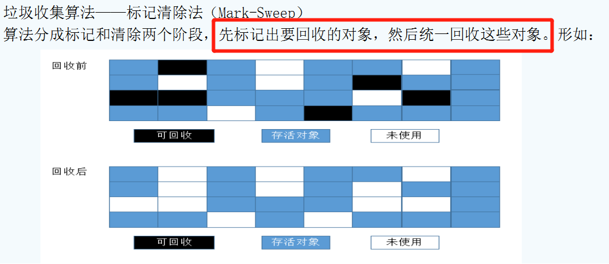

# GC 算法

## 1. GC是什么

垃圾收集 Garbage Collection 通常被称为“GC”，主要指的是Java垃圾回收机制。

每个程序员都遇到过内存溢出的情况，程序运行时，内存空间是有限的，那么如何及时的把不再使用的对象清除将内存释放出来，这就是GC要做的事。

**理解GC机制就从：“GC的区域在哪里”，“GC的对象是什么”，“GC的时机是什么”，“GC做了哪些事”几方面来分析。**

GC(分代收集算法)可以总结为三句话：

* 次数上频繁收集Young区
* 次数上较少收集Old区
* 基本不动元空间

### 1. 1 GC的作用区域

GC的作用范围包括方法区和堆，但主要是在堆中发生。

### 1.2 GC的对象

需要进行回收的对象就是已经没有存活的对象，判断一个对象是否存活常用的有两种办法：引用计数和可达分析。

（1）引用计数：每个对象有一个引用计数属性，新增一个引用时计数加1，引用释放时计数减1，计数为0时可以回收。此方法简单，无法解决对象相互循环引用的问题。

（2）可达性分析（Reachability Analysis）：从GC Roots开始向下搜索，搜索所走过的路径称为引用链。当一个对象到GC Roots没有任何引用链相连时，则证明此对象是不可用的。不可达对象。

> 在Java语言中，GC Roots包括：
>
> * 虚拟机栈中引用的对象。
>
> * 方法区中类静态属性实体引用的对象。
>
> * 方法区中常量引用的对象。
>
> * 本地方法栈中JNI引用的对象。

### 1.3 GC的触发条件

(1)程序调用System.gc时可以触发

(2)系统自身来决定GC触发的时机（根据Eden区和From Space区的内存大小来决定。当内存大小不足时，则会启动GC线程并停止应用线程）

GC又分为 minor GC 和 Full GC (也称为 Major GC )

**Minor GC触发条件：**当Eden区满时，触发Minor GC。

**Full GC触发条件：**

 a.调用System.gc时，系统建议执行Full GC，但是不必然执行

 b.老年代空间不足

 c.方法去空间不足

 d.通过Minor GC后进入老年代的平均大小大于老年代的可用内存

 e.由Eden区、From Space区向To Space区复制时，对象大小大于To Space可用内存，则把该对象转存到老年代，且老年代的可用内存小于该对象大小

JVM在进行GC时，并非每次都对上面三个内存区域一起回收的，大部分时候回收的都是指新生代。
因此GC按照回收的区域又分了两种类型，一种是普通GC（minor GC），一种是全局GC（major GC or Full GC）

**Minor GC和Full GC的区别**

* 普通GC（minor GC）：只针对新生代区域的GC,指发生在新生代的垃圾收集动作，因为大多数Java对象存活率都不高，所以Minor GC非常频繁，一般回收速度也比较快。 

* 全局GC（major GC or Full GC）：指发生在老年代的垃圾收集动作，出现了Major GC，经常会伴随至少一次的Minor GC（但并不是绝对的）。Major GC的速度一般要比Minor GC慢上10倍以上 

## 2. GC常用算法

GC(分代收集算法)有4大算法：

* 引用计数法
* 复制算法
* 标记清除
* 标记压缩

### 2.1 引用计数法

### 2.2 复制算法(Copying)

**年轻代**中使用的是Minor GC，这种GC算法采用的是复制算法(Copying)

HotSpot JVM把年轻代分为了三部分：1个Eden区和2个Survivor区（分别叫from和to）。默认比例为**8:1:1**,一般情况下，新创建的对象都会被分配到Eden区(一些大对象特殊处理),这些对象经过第一次Minor GC后，如果仍然存活，将会被移到Survivor区。对象在Survivor区中每熬过一次Minor GC，年龄就会增加1岁，当它的年龄增加到一定程度时，就会被移动到年老代中。因为年轻代中的对象基本都是朝生夕死的(90%以上)，所以在**年轻代的垃圾回收算法使用的是复制算法**，复制算法的基本思想就是将内存分为两块，每次只用其中一块，当这一块内存用完，就将还活着的对象复制到另外一块上面。**复制算法不会产生内存碎片。**

在GC开始的时候，对象只会存在于Eden区和名为“From”的Survivor区，Survivor区“To”是空的。紧接着进行GC，Eden区中所有存活的对象都会被复制到“To”，而在“From”区中，仍存活的对象会根据他们的年龄值来决定去向。年龄达到一定值(年龄阈值，可以通过-XX:MaxTenuringThreshold来设置，默认为15)的对象会被移动到年老代中，没有达到阈值的对象会被复制到“To”区域。**经过这次GC后，Eden区和From区已经被清空。这个时候，“From”和“To”会交换他们的角色，也就是新的“To”就是上次GC前的“From”，新的“From”就是上次GC前的“To”。**不管怎样，都会保证名为To的Survivor区域是空的。Minor GC会一直重复这样的过程，直到“To”区被填满，“To”区被填满之后，会将所有对象移动到年老代中。

因为Eden区对象一般存活率较低，一般的，使用两块10%的内存作为空闲和活动区间，而另外80%的内存，则是用来给新建对象分配内存的。一旦发生GC，将10%的from活动区间与另外80%中存活的eden对象转移到10%的to空闲区间，接下来，将之前90%的内存全部释放，以此类推。 

**优点**

实现简单；不产生内存碎片

**缺点**
每次运行，Survive区总有一半内存是空的，导致其可使用的内存空间只有原来的一半。

### 2.3 标记清除(Mark-Sweep)

**老年代**一般是由标记清除或者是标记清除与标记整理的混合实现

用通俗的话解释一下标记清除算法，就是当程序运行期间，若可以使用的内存被耗尽的时候，GC线程就会被触发并将程序暂停，随后将要回收的对象标记一遍，最终统一回收这些对象，完成标记清理工作接下来便让应用程序恢复运行。

主要进行两项工作，第一项则是标记，第二项则是清除。  

* 标记：从引用根节点开始标记遍历所有的GC Roots， 先标记出要回收的对象。
*   清除：遍历整个堆，把标记的对象清除。 

**缺点：此算法需要暂停整个应用，会产生内存碎片** 

### 2.4 标记压缩(Mark-Compact)

在整理压缩阶段，不再对标记的对象做回收，而是通过所有存活对象都向一端移动，然后直接清除边界以外的内存。
可以看到，标记的存活对象将会被整理，按照内存地址依次排列，而未被标记的内存会被清理掉。如此一来，当我们需要给新对象分配内存时，JVM只需要持有一个内存的起始地址即可，这比维护一个空闲列表显然少了许多开销。 

标记/整理算法不仅可以弥补标记/清除算法当中，内存区域分散的缺点，也消除了复制算法当中，内存减半的高额代价

**缺点**

标记/整理算法唯一的缺点就是效率也不高，不仅要标记所有存活对象，还要整理所有存活对象的引用地址。
从效率上来说，标记/整理算法要低于复制算法。

**标记清除压缩(Mark-Sweep-Compact)**

原理：

1. 标记清除与标记压缩的结合
2. 与标记清除一致，当多次GC后才压缩，从而减少移动对象的成本

### 2.5 分代收集算法

内存效率：复制算法>标记清除算法>标记整理算法（此处的效率只是简单的对比时间复杂度，实际情况不一定如此）。 
内存整齐度：复制算法=标记整理算法>标记清除算法。 
内存利用率：标记整理算法=标记清除算法>复制算法。 

可以看出，效率上来说，复制算法是当之无愧的老大，但是却浪费了太多内存，而为了尽量兼顾上面所提到的三个指标，标记/整理算法相对来说更平滑一些，但效率上依然不尽如人意，它比复制算法多了一个标记的阶段，又比标记/清除多了一个整理内存的过程

难道就没有一种最优算法吗？

 回答：无，没有最好的算法，只有最合适的算法。==========>**分代收集算法。**

**年轻代(Young Gen)**  

年轻代特点是区域相对老年代较小，对象存活率低。

这种情况复制算法的回收整理，速度是最快的。复制算法的效率只和当前存活对象大小有关，因而很适用于年轻代的回收。而复制算法内存利用率不高的问题，通过hotspot中的两个survivor的设计得到缓解。

**老年代(Tenure Gen)**

老年代的特点是区域较大，对象存活率高。

这种情况，存在大量存活率高的对象，复制算法明显变得不合适。一般是由标记清除或者是标记清除与标记整理的混合实现。

Mark阶段的开销与存活对象的数量成正比，这点上说来，对于老年代，标记清除或者标记整理有一些不符，但可以通过多核/线程利用，对并发、并行的形式提标记效率。

Sweep阶段的开销与所管理区域的大小形正相关，但Sweep“就地处决”的特点，回收的过程没有对象的移动。使其相对其它有对象移动步骤的回收算法，仍然是效率最好的。但是需要解决内存碎片问题。

Compact阶段的开销与存活对象的数据成开比，如上一条所描述，对于大量对象的移动是很大开销的，做为老年代的第一选择并不合适。

基于上面的考虑，老年代一般是由标记清除或者是标记清除与标记整理的混合实现。以hotspot中的CMS回收器为例，CMS是基于Mark-Sweep实现的，对于对象的回收效率很高，而对于碎片问题，CMS采用基于Mark-Compact算法的Serial Old回收器做为补偿措施：当内存回收不佳（碎片导致的Concurrent Mode Failure时），将采用Serial Old执行Full GC以达到对老年代内存的整理。

## 3. 垃圾收集器

如果说收集算法是内存回收的方法论，垃圾收集器就是内存回收的具体实现

### 3.1 Serial收集器

串行收集器是最古老，最稳定以及效率高的收集器
可能会产生较长的停顿，只使用一个线程去回收
`-XX:+UseSerialGC`

- 新生代、老年代使用串行回收
- 新生代复制算法
- 老年代标记-压缩

### 3.2 并行收集器

#### 3.2.1 ParNew

`-XX:+UseParNewGC`（new代表新生代，所以适用于新生代）

- 新生代并行
- 老年代串行

*Serial收集器新生代的并行版本*
在新生代回收时使用复制算法
多线程，需要多核支持
`-XX:ParallelGCThreads` 限制线程数量

 

#### 3.2.2 Parallel收集器

类似ParNew 
新生代复制算法 
老年代标记-压缩 
更加关注吞吐量 
`-XX:+UseParallelGC `

- 使用Parallel收集器+ 老年代串行

`-XX:+UseParallelOldGC `

- 使用Parallel收集器+ 老年代并行

#### 3.2.3 其他GC参数

`-XX:MaxGCPauseMills`

- 最大停顿时间，单位毫秒
- GC尽力保证回收时间不超过设定值

`-XX:GCTimeRatio `

- 0-100的取值范围
- 垃圾收集时间占总时间的比
- 默认99，即最大允许1%时间做GC

这两个参数是矛盾的。因为停顿时间和吞吐量不可能同时调优

### 3.3 CMS收集器

- Concurrent Mark Sweep 并发标记清除（应用程序线程和GC线程交替执行）
- 使用标记-清除算法
- 并发阶段会降低吞吐量（停顿时间减少，吞吐量降低）
- 老年代收集器（新生代使用ParNew）
- `-XX:+UseConcMarkSweepGC`

CMS运行过程比较复杂，着重实现了标记的过程，可分为

1.初始标记（会产生全局停顿）

* 根可以直接关联到的对象

- 速度快

2.并发标记（和用户线程一起） 

- 主要标记过程，标记全部对象

3.重新标记 （会产生全局停顿） 

- 由于并发标记时，用户线程依然运行，因此在正式清理前，再做修正

4.并发清除（和用户线程一起） 

- 基于标记结果，直接清理对象

 

这里就能很明显的看出，为什么CMS要使用标记清除而不是标记压缩，如果使用标记压缩，需要多对象的内存位置进行改变，这样程序就很难继续执行。但是标记清除会产生大量内存碎片，不利于内存分配。 

**CMS收集器特点：**

尽可能降低停顿
会影响系统整体吞吐量和性能

> 比如，在用户线程运行过程中，分一半CPU去做GC，系统性能在GC阶段，反应速度就下降一半

清理不彻底 

> 因为在清理阶段，用户线程还在运行，会产生新的垃圾，无法清理

因为和用户线程一起运行，不能在空间快满时再清理（因为也许在并发GC的期间，用户线程又申请了大量内存，导致内存不够） 

- `-XX:CMSInitiatingOccupancyFraction`设置触发GC的阈值
- 如果不幸内存预留空间不够，就会引起concurrent mode failure

一旦 concurrent mode failure产生，将使用串行收集器作为后备。

**CMS也提供了整理碎片的参数：**

`-XX:+ UseCMSCompactAtFullCollection` Full GC后，进行一次整理

- 整理过程是独占的，会引起停顿时间变长

`-XX:+CMSFullGCsBeforeCompaction `

- 设置进行几次Full GC后，进行一次碎片整理

`-XX:ParallelCMSThreads `

- 设定CMS的线程数量（一般情况约等于可用CPU数量）

CMS的提出是想改善GC的停顿时间，在GC过程中的确做到了减少GC时间，但是同样导致产生大量内存碎片，又需要消耗大量时间去整理碎片，从本质上并没有改善时间。 

 

### 3.4 G1收集器

G1是目前技术发展的最前沿成果之一，HotSpot开发团队赋予它的使命是未来可以替换掉JDK1.5中发布的CMS收集器。

与CMS收集器相比G1收集器有以下特点：

(1) 空间整合，G1收集器采用标记整理算法，不会产生内存空间碎片。分配大对象时不会因为无法找到连续空间而提前触发下一次GC。

(2)可预测停顿，这是G1的另一大优势，降低停顿时间是G1和CMS的共同关注点，但G1除了追求低停顿外，还能建立可预测的停顿时间模型，能让使用者明确指定在一个长度为N毫秒的时间片段内，消耗在垃圾收集上的时间不得超过N毫秒，这几乎已经是实时Java（RTSJ）的垃圾收集器的特征了。

上面提到的垃圾收集器，收集的范围都是整个新生代或者老年代，而G1不再是这样。使用G1收集器时，Java堆的内存布局与其他收集器有很大差别，它将整个Java堆划分为多个大小相等的独立区域（Region），虽然还保留有新生代和老年代的概念，但新生代和老年代不再是物理隔阂了，它们都是一部分（可以不连续）Region的集合。

G1的新生代收集跟ParNew类似，当新生代占用达到一定比例的时候，开始出发收集。

和CMS类似，G1收集器收集老年代对象会有短暂停顿。

步骤：

(1)标记阶段，首先初始标记(Initial-Mark),这个阶段是停顿的(Stop the World Event)，并且会触发一次普通Mintor GC。对应GC log:GC pause (young) (inital-mark)

(2)Root Region Scanning，程序运行过程中会回收survivor区(存活到老年代)，这一过程必须在young GC之前完成。

(3)Concurrent Marking，在整个堆中进行并发标记(和应用程序并发执行)，此过程可能被young GC中断。在并发标记阶段，若发现区域对象中的所有对象都是垃圾，那个这个区域会被立即回收(图中打X)。同时，并发标记过程中，会计算每个区域的对象活性(区域中存活对象的比例)。

 

(4)Remark, 再标记，会有短暂停顿(STW)。再标记阶段是用来收集 并发标记阶段 产生新的垃圾(并发阶段和应用程序一同运行)；G1中采用了比CMS更快的初始快照算法:snapshot-at-the-beginning (SATB)。

(5)Copy/Clean up，多线程清除失活对象，会有STW。G1将回收区域的存活对象拷贝到新区域，清除Remember Sets，并发清空回收区域并把它返回到空闲区域链表中。

 

(6)复制/清除过程后。回收区域的活性对象已经被集中回收到深蓝色和深绿色区域。