# JVM体系结构概览
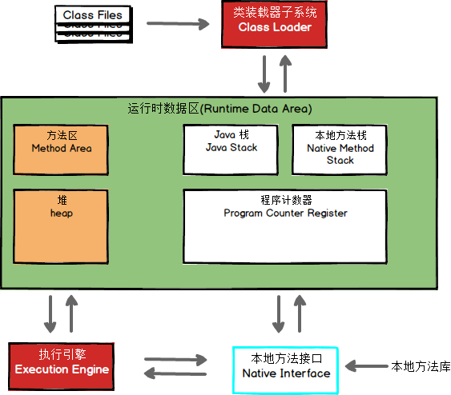


## 1.类装载器ClassLoader
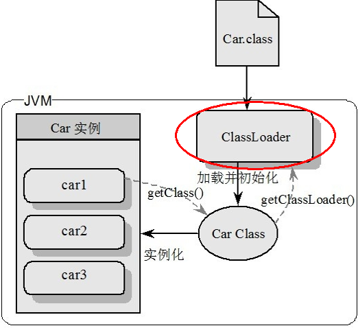
负责加载class文件，class文件在**文件开头有特定的文件标示**，将class文件字节码内容加载到内存中，并将这些内容**转换成方法区中的运行时数据结构**并且ClassLoader只负责class文件的加载，至于它是否可以运行，则由Execution Engine决定 

### 1.1 几种类加载器
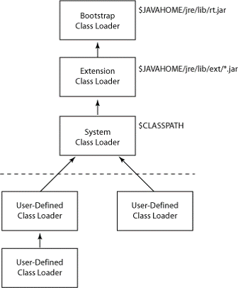
**虚拟机自带的加载器**
* 启动类加载器（Bootstrap）C++
* 扩展类加载器（Extension）Java
* 应用程序类加载器（AppClassLoader）Java也叫系统类加载器，加载当前应用的classpath的所有类

**用户自定义加载器**
* Java.lang.ClassLoader的子类，用户可以定制类的加载方式

### 1.2 双亲委派机制

当一个类收到了类加载请求，他首先不会尝试自己去加载这个类，而是把这个请求委派给父类去完成，每一个层次类加载器都是如此，因此所有的加载请求都应该传送到启动类加载其中，只有当父类加载器反馈自己无法完成这个请求的时候（在它的加载路径下没有找到所需加载的Class），子类加载器才会尝试自己去加载。 

采用双亲委派的一个好处是比如加载位于 rt.jar 包中的类 java.lang.Object，不管是哪个加载器加载这个类，最终都是委托给顶层的启动类加载器进行加载，这样就保证了使用不同的类加载器最终得到的都是同样一个 Object对象。 

## 2. Execution Engine
Execution Engine执行引擎负责解释命令，提交操作系统执行。 

## 3. Native Interface本地接口
Java屈服于C/C++淫威之下，只能在内存中专门开辟了一块区域处理标记为native的代码（保护费），它的具体做法是 Native Method Stack中登记 native方法，在Execution Engine 执行时加载native libraies。
目前该方法使用的越来越少了，除非是与硬件有关的应用。
>native是一个关键字,在Thread.start0方法中有用到，而该方法只有声明没有实现，是因为该方法的实现不由Java负责，而是由更底层
>的C和操作系统负责。

## 4. Native Method Stack
它的具体做法是Native Method Stack中登记native方法，在Execution Engine 执行时加载本地方法库。

## 5. PC寄存器 Program Counter Register
**PC寄存器记录了方法之间的调用和执行情况(类似于spark中的RDD血缘)，它相当于方法簇的排班值日表。**

每个线程都有一个程序计数器，是线程私有的,就是一个指针，指向方法区中的方法字节码（用来存储指向下一条指令的地址,也即将要执行的指令代码），由执行引擎读取下一条指令，是一个非常小的内存空间，几乎可以忽略不记。

这块内存区域很小，它是当前线程所执行的字节码的行号指示器，字节码解释器通过改变这个计数器的值来选取下一条需要执行的字节码指令。

如果执行的是一个Native方法，那这个计数器是空的。

用以完成分支、循环、跳转、异常处理、线程恢复等基础功能。不会发生内存溢出(OutOfMemory=OOM)错误

## 6. 方法区Method Area
* 所有线程共享
* 存在GC机制（垃圾回收）
* 方法区不是放方法的地方，而是放“模板”的地方

方法区是供各线程共享的运行时内存区域。它**存储了每一个类的结构信息**，例如运行时常量池（Runtime Constant Pool）、字段和方法数据、构造函数和普通方法的字节码内容。

上面讲的是规范，在不同虚拟机里头实现是不一样的，最典型的就是永久代(PermGen space)和元空间(Metaspace)。
```java
规范 gt = new 落地实现
空调 kt = new 格力
方法区 f = new 永久带 //java 7
方法区 f = new 元空间 //java 8
```
But！！实例变量存在堆内存中,和方法区无关


## 7. 栈Stack
### 7.1 栈管运行，堆管存储
栈也叫栈内存，主管Java程序的运行，是在线程创建时创建，它的生命期是跟随线程的生命期，
线程结束栈内存也就释放，对于栈来说不存在垃圾回收问题，只要线程一结束该栈就Over，
生命周期和线程一致，是线程私有的。

### 7.2 栈保存什么东东
_8种基本类型的变量+对象的引用变量+实例方法都是在函数的栈内存中分配。_

栈帧(=java方法)中主要保存3 类数据：
* 本地变量（Local Variables）:输入参数和输出参数以及方法内的变量；
* 栈操作（Operand Stack）:记录出栈、入栈的操作；
* 栈帧数据（Frame Data）:包括类文件、方法等等。

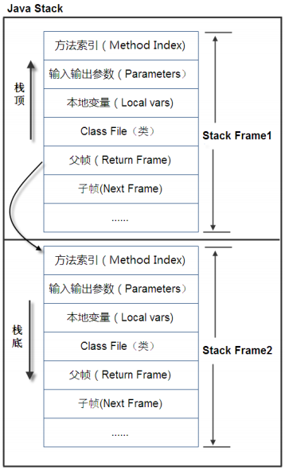

### 7.3 栈、堆、方法区的交互
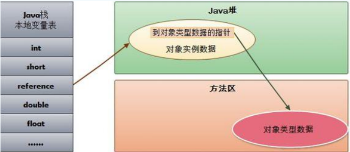
* HotSpot(jdk)是使用指针的方式来访问对象：
* Java堆中会存放访问类元数据的地址，
* reference存储的就直接是对象的地址


## 8. 堆Heap
一个JVM实例只存在一个堆内存，堆内存的大小是可以调节的。
类加载器读取了类文件后，需要把类、方法、常变量放到堆内存中，
保存所有引用类型的真实信息，以方便执行器执行，堆内存在逻辑上分为三部分：
* 新生区New
* 养老区Old
* 永久区(元空间)Perm

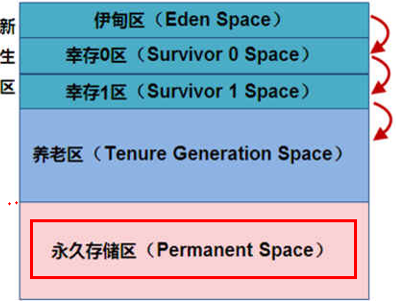

### 8.1 新生区GC过程(Minor GC)
新生区是类的诞生、成长、消亡的区域，一个类在这里产生，应用，最后被垃圾回收器收集，结束生命。所有的类都是在伊甸区被new出来的。

新生区又分为两部分： 伊甸区（Eden space）和幸存者区（Survivor pace），
其中幸存区有两个： 0区(from区)和1区(to区)。

#### 8.1.1 整体GC过程
当伊甸园的空间用完时，程序又需要创建对象，JVM的垃圾回收器将对伊甸园区进行垃圾回收(Minor GC)，
将伊甸园区中的不再被其他对象所引用的对象进行销毁。然后将伊甸园中的剩余对象移动到幸存 0区。
若幸存 0区也满了，再对该区进行垃圾回收，然后移动到 1 区。那如果1 区也满了呢？再移动到养老区。
若养老区也满了，那么这个时候将产生MajorGC（FullGC），进行养老区的内存清理。
若养老区执行了Full GC之后发现依然无法进行对象的保存，就会产生OOM异常“OutOfMemoryError”。

如果出现java.lang.OutOfMemoryError: Java heap space异常，说明Java虚拟机的堆内存不够。原因有二：
* （1）Java虚拟机的堆内存设置不够，可以通过参数-Xms、-Xmx来调整。
* （2）代码中创建了大量大对象，并且长时间不能被垃圾收集器收集（存在被引用）。


#### 8.1.2 MinorGC的过程（复制->清空->互换） 
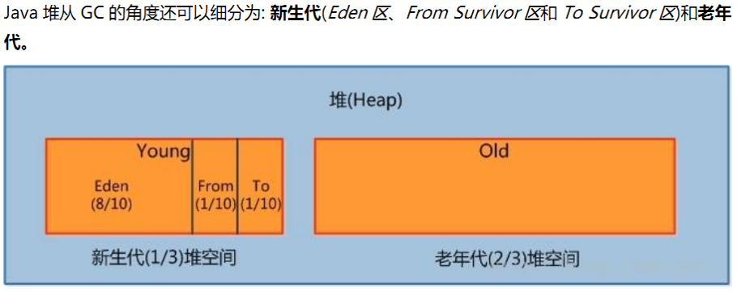

1：eden、SurvivorFrom 复制到 SurvivorTo，年龄+1 
首先，当Eden区满的时候会触发第一次GC,把还活着的对象拷贝到SurvivorFrom区，
当Eden区再次触发GC的时候会扫描Eden区和From区域,对这两个区域进行垃圾回收，
经过这次回收后还存活的对象,则直接复制到To区域（如果有对象的年龄已经达到了老年的标准，则赋值到老年代区），
同时把这些对象的年龄+1

2：清空 eden、SurvivorFrom 
然后，清空Eden和SurvivorFrom中的对象，也即复制之后有交换，谁空谁是to

3：SurvivorTo和 SurvivorFrom 互换 
最后，SurvivorTo和SurvivorFrom互换，原SurvivorTo成为下一次GC时的SurvivorFrom区。
部分对象会在From和To区域中复制来复制去,如此交换15次(由JVM参数MaxTenuringThreshold决定,这个参数默认是15),
最终如果还是存活,就存入到老年代

### 8.2 堆的逻辑分区与物理分区
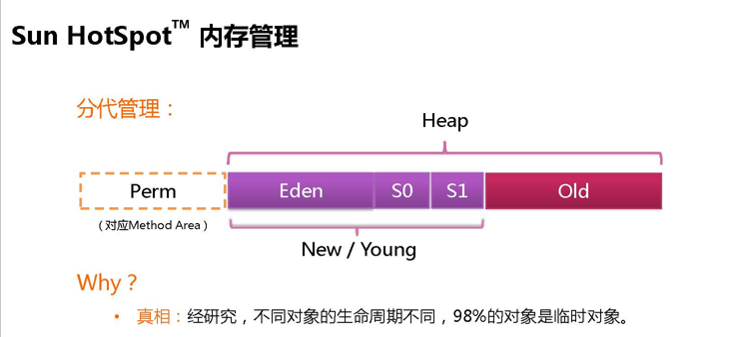

实际而言，方法区（Method Area）和堆一样，是各个线程共享的内存区域，
它用于存储虚拟机加载的：类信息+普通常量+静态常量+编译器编译后的代码等等，
**虽然JVM规范将方法区描述为堆的一个逻辑部分，但它却还有一个别名叫做Non-Heap(非堆)，目的就是要和堆分开。**
 	
对于HotSpot虚拟机，很多开发者习惯将方法区称之为“永久代(Parmanent Gen)” ，
但严格本质上说两者不同，或者说使用永久代来实现方法区而已，
永久代是方法区(相当于是一个接口interface)的一个实现，jdk1.7的版本中，已经将原本放在永久代的字符串常量池移走。


### 8.3 永久区(jdk8-元空间)
永久存储区是一个常驻内存区域，用于存放JDK自身所携带的 Class,Interface 的元数据，
也就是说它存储的是运行环境必须的类信息，被装载进此区域的数据是不会被垃圾回收器回收掉的，
关闭 JVM 才会释放此区域所占用的内存。


### 8.4 堆参数调优入门
**Java 7**

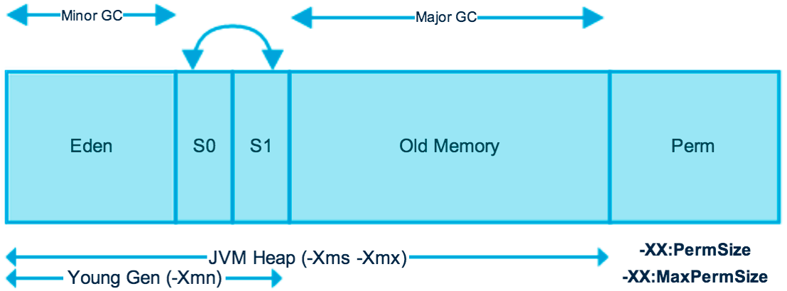
---
**Java 8**

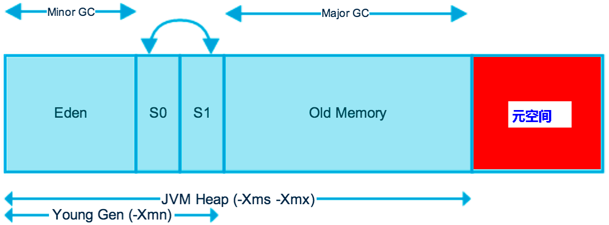
在Java8中，永久代已经被移除，被一个称为元空间的区域所取代。元空间的本质和永久代类似。

元空间与永久代之间最大的区别在于：
永久带使用的JVM的堆内存，但是**java8以后的元空间并不在虚拟机中而是使用本机物理内存。**

因此，默认情况下，元空间的大小仅受本地内存限制。类的元数据放入 native memory, 字符串池和类的静态变量放入 java 堆中，这样可以加载多少类的元数据就不再由MaxPermSize 控制, 而由系统的实际可用空间来控制。 

**可调参数**

| 参数                 | 说明                                      |
| -------------------- | ----------------------------------------- |
| `-Xms`               | 设置初始分配大小,默认为物理内存的`“1/64”` |
| `-Xmx`               | 最大分配内存，默认为物理内存的`“1/4”`     |
| `-XX:+PrintGCDetail` | 输出详细的GC处理日志                      |

**查看内存信息**
```java
public static void main(String[] args){
long maxMemory = Runtime.getRuntime().maxMemory() ;//返回 Java 虚拟机试图使用的最大内存量。
long totalMemory = Runtime.getRuntime().totalMemory() ;//返回 Java 虚拟机中的内存总量。
System.out.println("MAX_MEMORY = " + maxMemory + "（字节）、" + (maxMemory / (double)1024 / 1024) + "MB");
System.out.println("TOTAL_MEMORY = " + totalMemory + "（字节）、" + (totalMemory / (double)1024 / 1024) + "MB");
}
```
输出
```java
-Xmx:MAX_MEMORY = 3784310784（字节）、3609.0MB
-Xms:TOTAL_MEMORY = 255328256（字节）、243.5MB
```
发现默认的情况下分配的内存是总内存(15.8G)的“1 / 4”、而初始化的内存为“1 / 64”

**实际生产环境中，初始内存总量需要配置为最大内存量，避免内存的使用忽高忽低。**

* VM参数：	`-Xms1024m -Xmx1024m -XX:+PrintGCDetails`

输出结果：

（java 7）

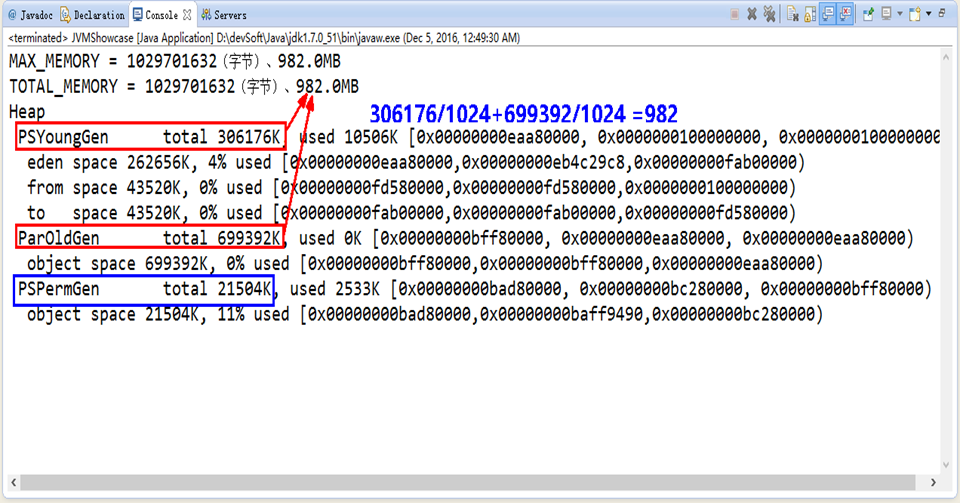

(java 8)

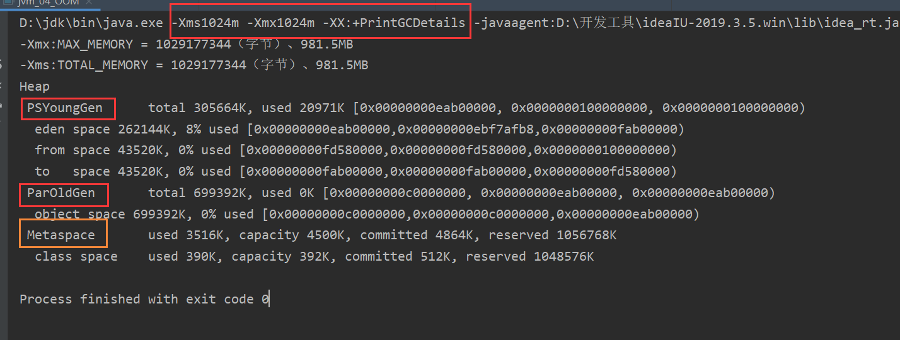


接下来演示OOM，我们先将Java可用内存调至10m,然后使用死循环不停地new对象

```java
public class jvm_04_OOM {
    public static void main(String[] args) {
        //Exception in thread "main" java.lang.OutOfMemoryError: Java heap space
        String str = "oom...";
        while (true){
            str += str+new Random().nextInt(888888888)+new Random().nextInt(999999999);
        }
        //byte[] bytes = new byte[1024*1024*40];
    }
}
```

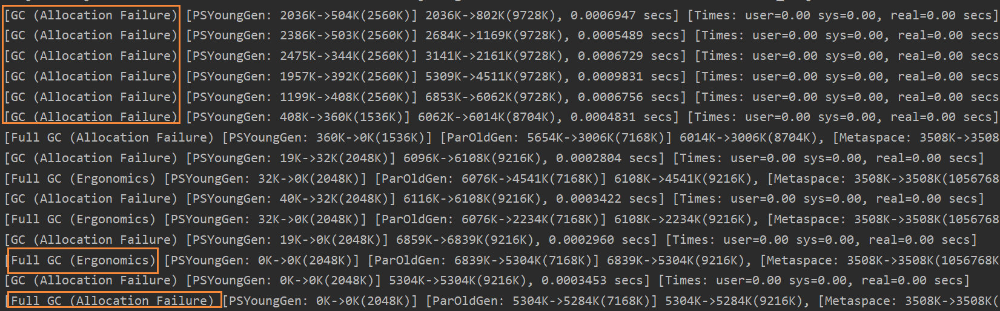

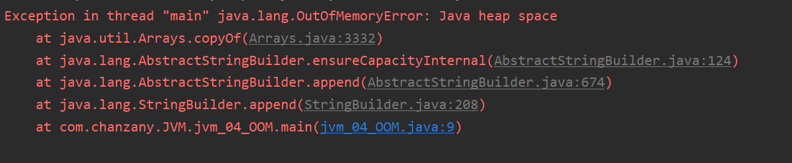


日志详解：

1. GC

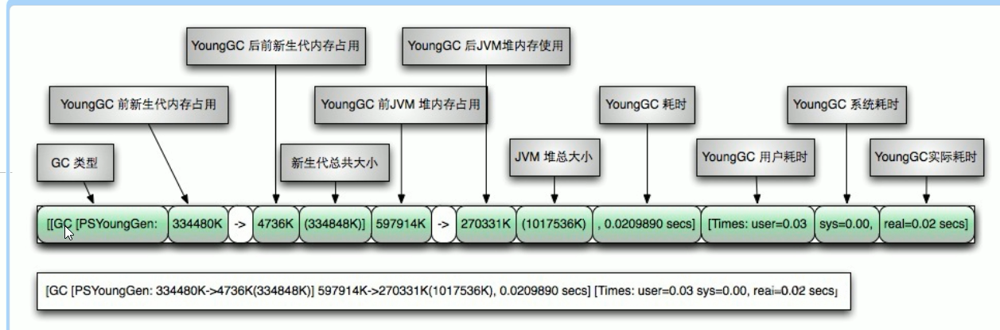


2. Full GC

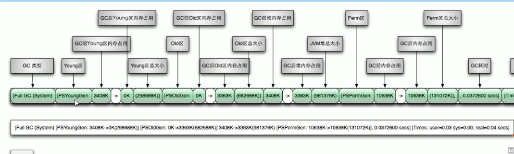


